# Setup
#### Install docker with
```
sudo apt-get update

sudo apt-get install ca-certificates curl gnupg lsb-release -y

curl -fsSL https://download.docker.com/linux/ubuntu/gpg | sudo gpg --dearmor -o /usr/share/keyrings/docker-archive-keyring.gpg

echo \
  "deb [arch=$(dpkg --print-architecture) signed-by=/usr/share/keyrings/docker-archive-keyring.gpg] https://download.docker.com/linux/ubuntu \
  $(lsb_release -cs) stable" | sudo tee /etc/apt/sources.list.d/docker.list > /dev/null

sudo apt-get update

sudo apt-get install docker-ce docker-ce-cli containerd.io -y
```

#### Run a nginx container with
`sudo docker run -d -p 80:80 --hostname inside-docker --name nginx nginx`

#### Open shell inside that docker container with 
`sudo docker exec -it nginx bash`

#### Install TCPDUMP inside the container
`apt-get update`
`apt-get upgrade -y`
`apt-get install tcpdump -y`

#### *We will communicate from the host to this container to test out our commands.


## 1. Draw the IP Header with detailed bits.

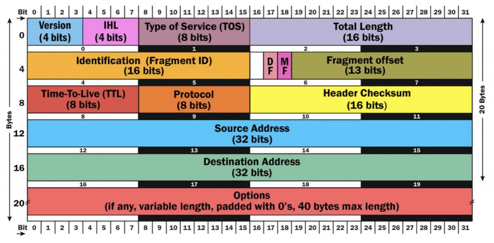

## 2. What is TCPDUMP?

Solution: TCPDUMP is a tool for analyzing network.

## 3. How to get the HTTPS traffic? 
`tcpdump -nnSX port 443`

from container: `tcpdump -nnSX port 443`

from host : `curl https://www.minhazul.com`

## 4. For everything on an interface, what is the command?
`tcpdump -i <interface name>`

FC: `tcpdump -i eth0`

FH: `curl localhost`

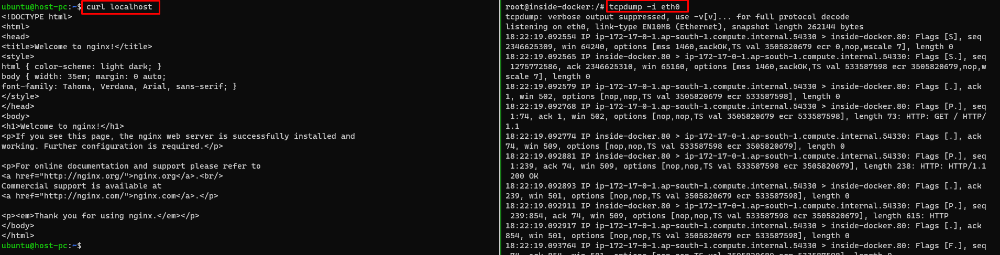
## 5. Write the command to find traffic by IP.
`tcpdump host <ip address>`

FC: `tcpdump host 172.17.0.1`

FH: `curl localhost`

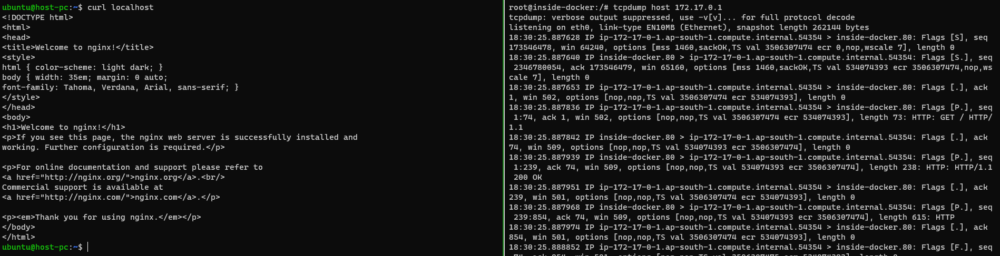


## 6. Share the filtering by source and destination?

`tcpdump src <ip address>`

`tcpdump dst <ip address>`

FC: `tcpdump src 172.17.0.1`

FH: `curl localhost`

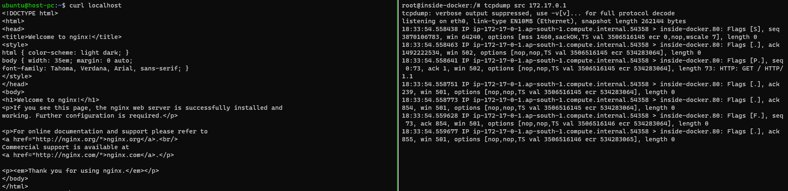

FC: `tcpdump dst 172.17.0.1`

FH: `curl localhost`

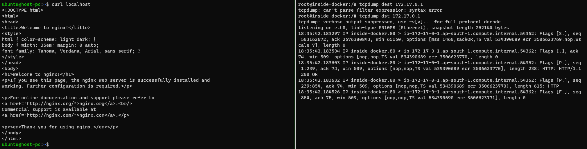

## 7. How to find packets by network?
`tcpdump net <network range>`

FC: `tcpdump net 172.17.0.0/24`

FH: `curl localhost`


## 8. How to see packet contents with hex output?
Solution: add `-X` flag

FC: `tcpdump dst 172.17.0.1 -X`

FH: `curl localhost`

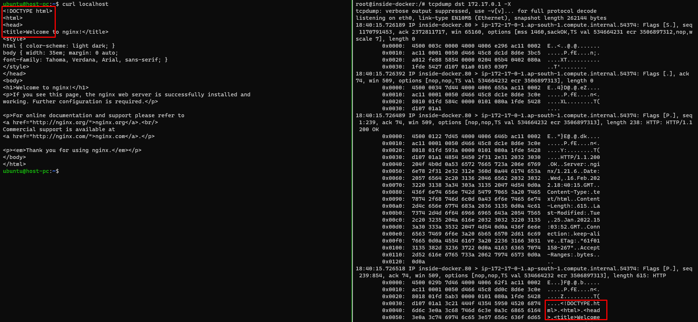

## 9. How to find a specific port traffic, write the command

`tcpdump port <port number>` 

`tcpdump src port <port number>`

`tcpdump dst port <port number>`

FC: `tcpdump port 80`

FH: `curl localhost`

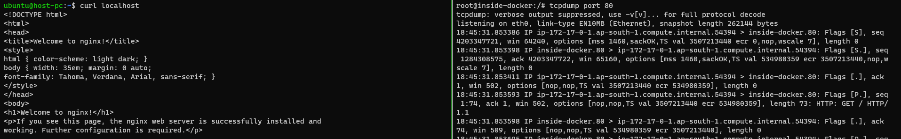

## 10. Show traffic of one protocol command.

`tcpdump <protocol>`

FC: `tcpdump icmp`

FH: `ping 172.17.0.2`

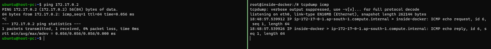

## 11. Write the command showing only IP6 traffic.

`tcpdump ip6`

## 12. Write the command for finding traffic using port range.
`tcpdump portrange <port range>`

FC: `tcpdump portrange 70-440`

FH: `curl localhost:80`

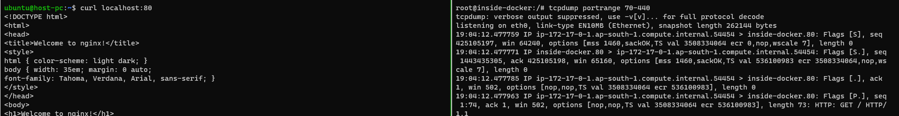

## 13. What are PCAP (PEE-cap) files?

PCAP or PEE-cap files are files that contains captured packets. These files can be used by many network analysis tools.

## 14. How are PCAP files processed and why is it so?

The PCAP files are processed by many softwares. They are stored captured packets in binary format.

## 15. Which switch is used to write the PCAP file called capture_file?
the `-w` switch

`tcpdump -w <filename>`

## 16. What is the command for reading/writing capture to a file?

Writing: `tcpdump -w <filename>`

Reading: `tcpdump -r <filename>`

FC: `tcpdump -w capture_file`

FH: `curl localhost`

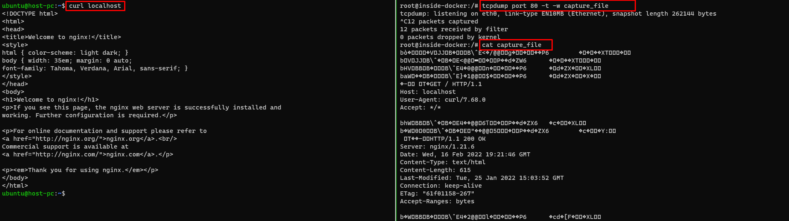


## 17. Which switch is needed to read the PCAP files?
The `-r` switch
## 18. What is the tcpdump command while reading in a file?

Writing: `tcpdump -r <filename>`

FC: `tcpdump -r capture_file`

FH: `curl localhost`

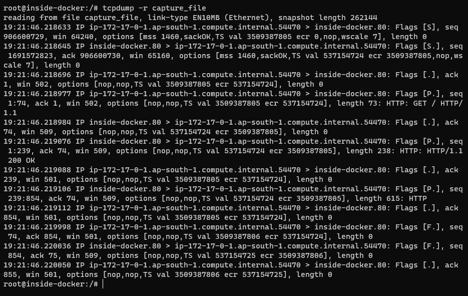

## 19. Which switch is used for the ethernet header?

The `-XX` flag

## 20. What is line-readable output? How is it notified?

The line readable output is used to view as the packets are being saved or to send output to other command through piping

## 21. What does `-q` imply?
It it used to make the output less informative.

FC: `tcpdump -q -i eth0`

FH: `curl localhost`

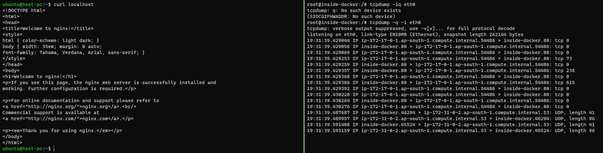

## 22. What does the tweak `-t` work?

Gives human readable timestamps.

## 23. What does `-tttt` show?

It gives the maximum human readable timestamp output

FC: `tcpdump -q -tttt -i eth0`

FH: `curl localhost`

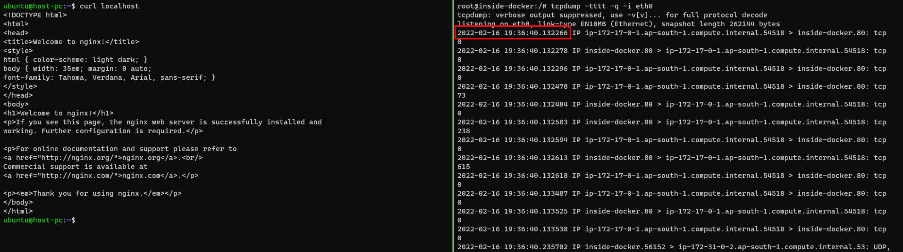


## 24. To listen on the eth0 interface which one is used?

The `-i eth0` flag

## 25. Purpose for `-vv`?

It is used for maximum verbose output.

## 26. Purpose for `-c`?
By providing a number after it, we can limit the captured packets.

FC: `tcpdump -q -tttt -i eth0 -c 1`

FH: `curl localhost`

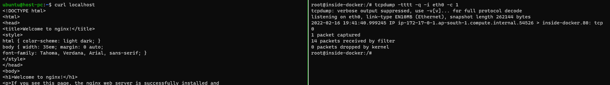


## 27. Why `-s` is used?
It is used to define the snaplength.
The `-s0` is used to get everything
## 28. What does -S, -e, -E imply?
The `-S` is used to print absolute sequence number.

The `-e` is used to print the ethernet header.

The `-E` is used to decrypt IPSEC traffic by providing encryption key.

## 29. How to show the raw output view?

`tcpdump -ttnnvvS`

FC: `tcpdump -ttnnvvS -i eth0`

FH: `curl localhost`

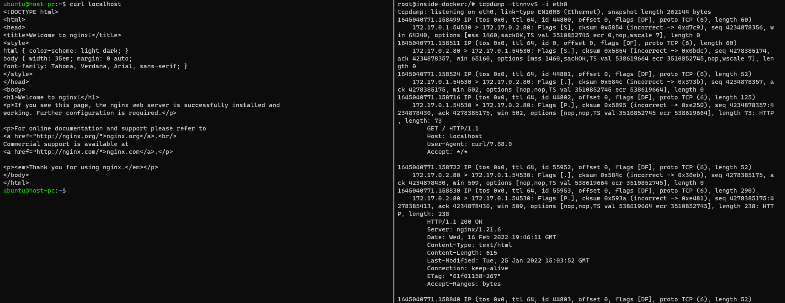

## 30. If a specific IP and destined course are given then which tweak is used?
The `and` or `&&` should be used

FC: `tcpdump src 172.17.0.1 and dst 172.17.0.2`

FH: `curl localhost`

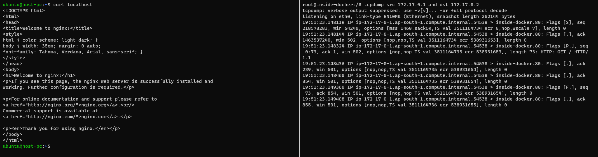

## 31. To pass from one network to another, write the command?

`tcpdump src net 192.168.0.0/16 and dst net 10.0.0.0/8 or 172.16.0.0/16`

## 32. If a non ICMP traffic goes to a specific IP, what should be the query?

`tcpdump dst 192.168.0.2 and src net and not icmp`

## 33. If a host isn't on a specific port, what will be tweaked and commanded?

`tcpdump -vv src host and not dst port 22`

## 34. Why single quotes are used?

`tcpdump 'src 10.0.2.4 and (dst port 3389 or 22)'`

single quotes are used for ignoring special characters. Like the `'('` and `')'` in this case.

## 35. How to isolate TCP RST flags?

`tcpdump 'tcp[13] & 4!=0'`

`tcpdump 'tcp[tcpflags] == tcp-rst'`

** RST flag means reset flag. Some routers send it when a connection has been idle for some time.

## 36. To isolate TCP SYN flags, which query is used?

`tcpdump 'tcp[13] & 2!=0'`

`tcpdump 'tcp[tcpflags] == tcp-syn'`

** SYN flag means synchronize message.

## 37. To isolate packets that have both the SYN and ACK flags set, what should be the command?

`tcpdump 'tcp[13]=18'`

## 38. How to isolate TCP URG flags?

`tcpdump 'tcp[13] & 32!=0'`

`tcpdump 'tcp[tcpflags] == tcp-urg'`
## 39. How to isolate TCP ACK flags?

`tcpdump 'tcp[13] & 16!=0'`

`tcpdump 'tcp[tcpflags] == tcp-ack'`
## 40. How to isolate TCP PSH flags?
`tcpdump 'tcp[13] & 8!=0'`

`tcpdump 'tcp[tcpflags] == tcp-push'`
## 41. How to isolate TCP FIN flags?

`tcpdump 'tcp[13] & 1!=0'`

`tcpdump 'tcp[tcpflags] == tcp-fin'`

## 42. How is GREP used with TCPDUMP?
By using the `-l` and piping output to grep.

## 43. Command for both SYN and RST flags?
`tcpdump 'tcp[13] = 6'`

## 44. What to do for cleartext GET requests?
`tcpdump -vvAls0 | grep 'GET'`

FC: `tcpdump -vvAls0 | grep 'GET'`

FH: `curl localhost`

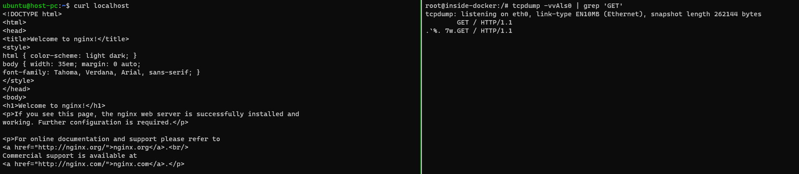


## 45. What to do to find HTTP host headers?
`tcpdump -vvAls0 | grep 'Host:'`

FC: `tcpdump -vvAls0 | grep 'Host:'`

FH: `curl localhost`

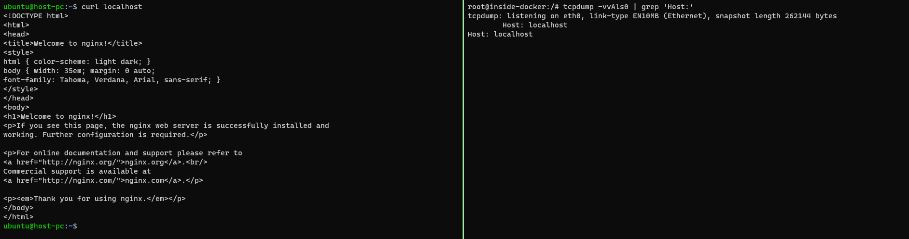

## 46. How to find HTTP cookies?

`tcpdump -vvAls0 | grep 'Set-Cookie|Host:|Cookie:'`

## 47. The command line for find SSH connections?
`tcpdump 'tcp[(tcp[12]>>2):4] = 0x5353482D'`

`tcpdump port 22`

## 48. How to find DNS traffic?

`tcpdump -vvAs0 port 53`

## 49. Command for finding FTP traffic?

`tcpdump -vvAs0 port 21`

## 50. Find NTP traffic, what is the command?

`tcpdump -vvAs0 port 123`

## 51. Command to find cleartext passwords?

`tcpdump port http or port ftp or port smtp or port imap or port pop3 or port telnet -lA | egrep -i -B5 'pass=|pwd=|log=|login=|user=|username=|pw=|passw=|passwd= |password=|pass:|user:|username:|password:|login:|pass |user '`

## 52. Describe EVIL bit.

An evil bit is a bit that never gets set by legitimate appliaction. 

## 53. Write the filter to find packets where it's been toggled?

`tcpdump 'ip[6] & 128 != 0'`

# TCPDUMP flags cheatsheet
`-D` Show list of available interfaces that tcpdump can listen to

`-i eth0` or `-i any` Listen to interface

`-e` Print link level header

`-q` Show less verbose output

`-v` Show more verbose output. For example, **the time to live**, **identification**, **total length** and **options** in an IP packet are printed. Also enables additional packet integrity checks such as verifying the IP and ICMP header checksum.

`-vv` Show even more output. For example, additional fields are printed from **NFS reply** packets, and **SMB packets** are fully decoded.

`-vvv` Be very verbose while capturing packets: For example, telnet SB ... SE options are printed in full.

`-n` No reverse DNS lookup for domain name. But resolves service name for ports.

`-nn` Don't resolve hostname or port names.

`-S` Print absolute sequence numbers.

`-s` Buffer limit. `-s0` For all bytes. `-s 500` Capture 500 bytes of data for each packet rather than the default of 68 bytes.

`-c` Limit the capture count.

`-x` Print the basic headers, plus print the data of each packet in hex, excluding the link level header.

`-xx` Print the basic headers, plus print the data of each packet in hex, including its link level header, in hex.

`-X` Print the data of each packet in both hex and ASCII, excluding the link level header

`-XX` Print the data of each packet in both hex and ASCII, also including the link level header.

`-A` Print each packet as ascii.

`-b` Print the AS number in BGP packets in ASDOT noation rather than ASPLAIN notation.

`-l` Line readable output.

`-t` or `-tttt` Give human readable timesteamp.

`-E` decrypt IPSEC traffic by providing encryption key.

`-w` To write to file

`-r` To read from file.


# Useful links
## [The blog](https://danielmiessler.com/study/tcpdump/#useragent)


