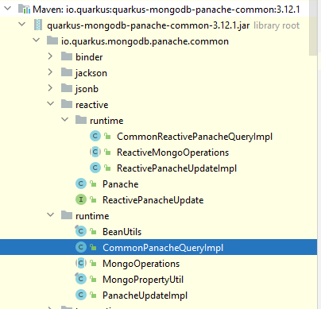
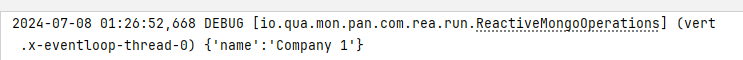
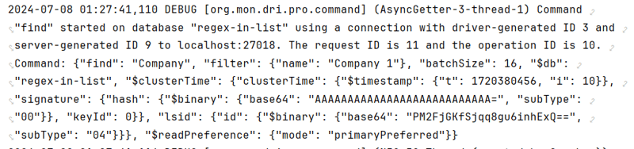

# Purpose
At my job I've been writing a microservice with java with reactive style. I'm also using mongodb with panache. Recently I had a problem where one of my queries were working perfectly from mongo compass but with panache it wasn't working as expected. So I needed to see the query that panache was generating.

The quarkus's official document provides a [way](https://quarkus.io/guides/mongodb-panache#query-debugging) to log mongodb query in output. Unfortunately it only works for non reactive java and the guide doesn't properly mention this.

```
quarkus.log.category."io.quarkus.mongodb.panache.common.runtime".level=DEBUG
```

At first I thought for some reason maybe my project configuration was wrong or maybe configs were conflicting and that's why it wasn't showing the logs. I never thought what reactive coding was the problem. So I debugged the issue in other ways and found the proper solution for my problem.

After that I got somewhat bothered and kept asking myself why the query logging wasn't working and got frustrated. Then in an eureka moment I looked at the configuration key carefully and I can clearly see that the log was enabling a category `io.quarkus.mongodb.panache.common.runtime` so I went looking for that package. From my jetbrains IDE I found it and I can clearly see that there is a `common.runtime.CommonPanacheQueryImpl` and another `common.reactive.runtime.CommonReactivePanacheQueryImpl`.



So I tried to filter by that category and it worked :) 
So the solution is to just enable `DEBUG` on this category. So add this line to your application.properties.
```
quarkus.log.category."io.quarkus.mongodb.panache.common.reactive.runtime".level=DEBUG
```

Now the logging is working



### Bonus
While searching I've found another way to enable query logging, but it is logging from the mongodb driver. To enable it just add this to the application.properties
```
quarkus.log.category."org.mongodb.driver.protocol.command".level=DEBUG
```
The result looks like this, it also outputs the result from the db.



Just thought that I'd post these configs here as a reference to someone who is doing reactive java with panache. As I've invested one of my weekends figuring this out as well as other things. I'll probably make a longer post on my journey as a Senior Software Engineer to debug a panache capability issue and how a junior might navigate these and what were my step by step thought process during this.

I've learned all these because I kept asking myself "why wouldn't it work?" and it kept bothering me.
